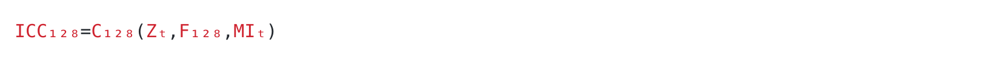
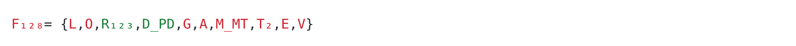

# Mathematical Interface Architecture Canonical Model

Status CURRENT CANDIDATE
Date 2026-09-25
Baseline ICC-128 Candidate V4

## Architecture

Let MIA be

MIA = ⟨O, I, R, P, L, V⟩

where

- O is the mathematical or formal object
- I is its versioned mathematical interface record
- R is reconstruction status at the smallest load-bearing component level
- P is the presentation or rendering projection
- L is lineage, provenance, and currentness
- V is validation and acceptance state

The protected law is

change(x) does not silently redefine y for distinct coordinates x and y.

## ICC-128 Candidate V4 baseline

The frozen top-level object is

ICC₁₂₈ = C₁₂₈(Zₜ, F₁₂₈, MIₜ)

The capability family is

F₁₂₈ = { L, O, R₁₂₃, D_PD, G, A, M_MT, T₂, E, V }

The interface family is

MIₜ = { Iᵏₜ | k ∈ Objectsₜ }

with candidate record

Iᵏₜ = ⟨ObjectID, VersionID, Math, ComponentStatus, WholeStatus, Renderer, Freshness⟩

The controller family is

Qₜ = ρ₁₂₈(Zₜ, MIₜ) ⊆ F₁₂₈

Yₜ = Run₁₂₈(Qₜ, Zₜ, MIₜ)

MIₜ₊₁ = Sync₁₂₈(MIₜ, Yₜ)

Zₜ₊₁ = U₁₂₈(Zₜ, Yₜ, MIₜ₊₁)

τ₁₂₈(Zₜ₊₁, MIₜ₊₁) ∈ { REENTER, CLOSE, OPEN, BLOCKED }

## Reconstruction state

Recovered mathematics presently includes R₁₂₃ and D_PD components documented by the V4 source lineage.

The unresolved frontier includes the remaining controller and interface primitives until their mathematical transformations are independently reconstructed and admitted.

The renderer may not change this classification.

## Visual canonical form

The canonical visible baseline is rendered through the SVG assets in assets/mia.

The assets are presentation projections of the frozen object. They are not separate mathematical definitions.
