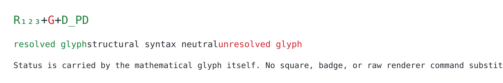

# Mathematical Color Invariant

Status CURRENT
Date 2026-09-25
Scope universal mathematical and formal output

## Invariant

Every status-bearing mathematical or formal component visibly carries its own reconstruction status at the point of use.

Resolved components are green.

Unresolved, partial, ambiguous, conflicting, or only-named components are red.

Pure structural syntax remains neutral unless that syntax is itself the object being evaluated.

## Smallest meaningful component

Color is assigned independently to the smallest load-bearing component whose reconstruction status can differ from its neighbors.

An entire equation is not green because its overall meaning is understood.

An entire tool is not red because one internal primitive remains unresolved.

## Glyph rule

Status is carried by the glyphs themselves.

A colored square, badge, emoji, legend, nearby label, heading, or prose sentence does not satisfy the invariant.

## Natural-form rule

Coloring never licenses a mathematical rewrite.

Preserve the object's accepted natural structure.

Do not change an equality into a flow.

Do not change a flow into a tuple.

Do not introduce a new left-hand-side object.

Do not alter decomposition merely to make coloring easier.

## Surface rule

The semantic invariant is surface-independent.

Chat uses a renderer that visibly colors the mathematical glyph.

GitHub uses preview-safe SVG when Markdown cannot preserve direct glyph color reliably.

Documents, slides, PDFs, diagrams, and other surfaces use their strongest native glyph-color mechanism.

A surface limitation never changes the semantic state.

## Emission gate

The gate applies before every user-visible emission that refers to a status-bearing formal object, including commentary, interim updates, tables, headings, plans, and final outputs.

A rendering path that cannot preserve the invariant is invalid for that emission.

## Canonical specimen

The specimen is normative for visible behavior.

## Failure conditions

The output fails when

- a status-bearing formal object appears uncolored
- a separate marker substitutes for glyph color
- a mixed-status expression is uniformly colored
- the renderer changes the mathematics
- visible raw rendering commands appear in place of the intended colored mathematics
- current status is guessed rather than recovered from the interface record

## Currentness

This artifact supersedes the two legacy Reaserch files MATHEMATICAL_COLOR_INVARIANT.md and UNIVERSAL_MATHEMATICAL_COLOR_INVARIANT.md as the Take-5 project surface.

Those files remain provenance sources and are not deleted.
